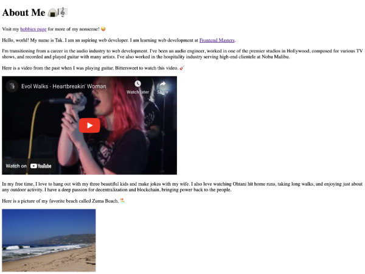
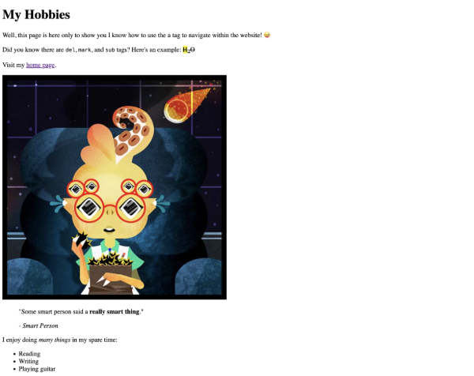
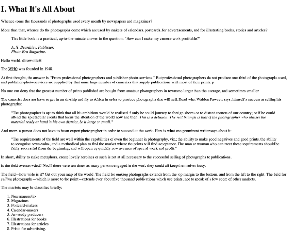

# Frontend Masters Bootcamp HTML Project

## Overview

This project is part of the Frontend Masters Bootcamp and is designed to demonstrate the use of various HTML tags and elements. The project includes multiple HTML files showcasing different aspects of HTML, including semantic HTML, embedded media, and navigation.

## Screenshots

  
_Screenshot of the index page showcasing the introduction, embedded video, and favorite links._

  
_Screenshot of the hobbies page demonstrating navigation and the use of different HTML tags._

  
_Screenshot of the book chapter page showing the use of semantic HTML tags._

## HTML Files

### `index.html`

This is the main page of the project. It includes:

- A brief introduction about me.
- A navigation link to the hobbies page.
- An embedded YouTube video.
- Quotes with proper citation.
- An unordered list of my favorite foods.
- Images with appropriate alt text and titles.

### `hobbies.html`

This page demonstrates navigation within the website. It includes:

- A link back to the home page.
- Examples of `<del>`, `<mark>`, and `` tags.
- An image with a descriptive alt text.
- A blockquote with a citation.
- An unordered list of my hobbies.

### `bookchapter.html`

This file includes examples of various HTML tags used for formatting and emphasizing text. It was an assignment to convert non-semantic HTML to fully semantic HTML. It includes:

- Semantic structure with headings, paragraphs, and blockquotes.
- Use of `<cite>` for citations.
- Demonstrations of `<bdo>`, `<abbr>`, `<strong>`, and `<em>` tags.
- Ordered lists for structured content.
- A footer with a citation and a link to the full book.

## HTML Tags Covered

The project covers a variety of HTML tags and elements, including but not limited to:

- Basic tags: `<html>`, `<head>`, `<body>`, `<title>`, `<meta>`
- Text formatting: `
`, `<h1>`, `<h2>`, `<h3>`, `<strong>`, `<em>`, `<del>`, `<mark>`, ``, `<abbr>`
- Links and navigation: `<a>`
- Lists: `<ul>`, `<ol>`, `<li>`, `<dl>`, `<dt>`, `<dd>`
- Media: ``, `<iframe>`
- Quotes and citations: `<blockquote>`, `<q>`, `<cite>`
- Semantic HTML: `<header>`, `<footer>`, `<article>`, `<section>`

## Usage

To view the project, open `index.html` in a web browser. Navigate through the pages using the links provided to explore the different HTML elements and features implemented.

## Acknowledgments

This project was developed as part of the [Frontend Masters Bootcamp](https://frontendmasters.com/bootcamp/).

## Links

- [Frontend Masters Bootcamp](https://frontendmasters.com/bootcamp/)
- [Course Link](https://frontendmasters.com/bootcamp/introduction-html/)
